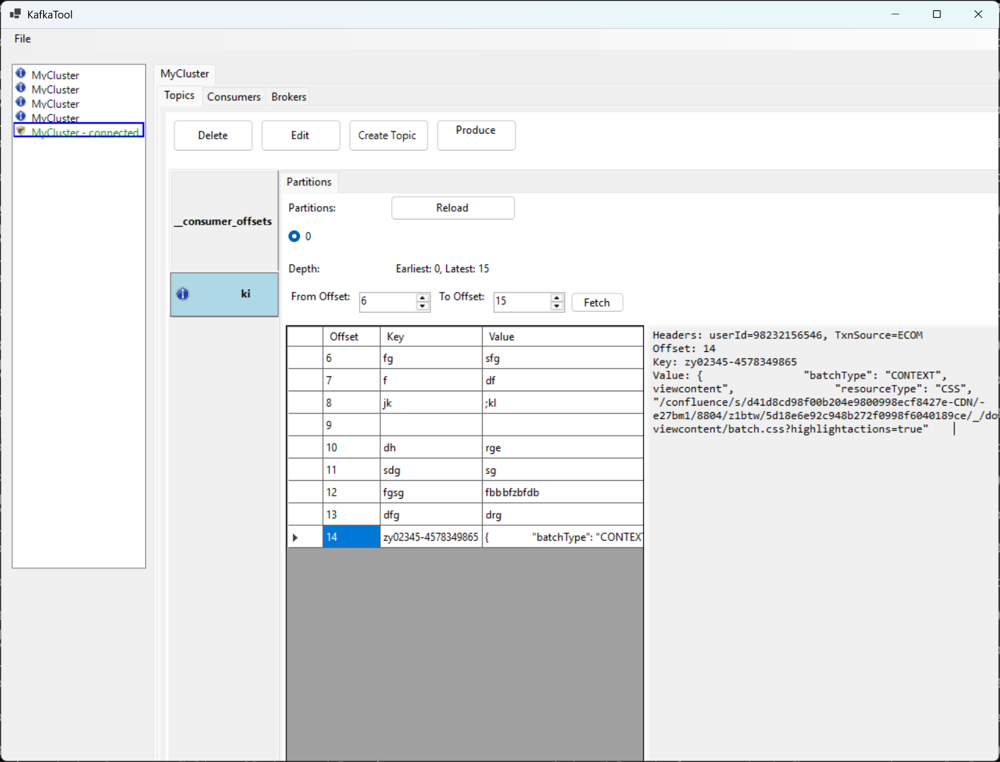

# Kafka UI Tool v2.0 - Cross-Platform Java/JavaFX Edition

A modern, cross-platform Kafka management tool built with Java and JavaFX, featuring an elegant dark theme UI and robust architecture.



## 🚀 New Java/JavaFX Implementation

The tool has been completely rewritten in Java using JavaFX for cross-platform compatibility and modern UI design.

### Key Features
- **Cross-Platform**: Runs on Windows, macOS, and Linux
- **Modern UI**: JavaFX with elegant dark theme and CSS styling
- **Robust Architecture**: MVC pattern with async operations and proper error handling
- **Apache Kafka Integration**: Uses official Apache Kafka Java client
- **Advanced Features**: Message search, filtering, export/import capabilities
- **Persistent Settings**: Automatic saving of cluster configurations

## Requirements
- **Java 17+**: OpenJDK or Oracle JDK 17 or higher
- **Maven 3.6+**: For building the project
- **JavaFX 21**: Included as dependency
- **Cross-Platform**: Works on Windows, macOS, and Linux

## 🎯 Features & Implementation Status

### ✅ Completed Features
- **Project Architecture**: Maven-based Java project with MVC pattern
- **Modern UI**: JavaFX with FXML and elegant dark theme CSS
- **Cluster Management**: Add, edit, delete, and connect to Kafka clusters
- **Topic Management**: List, create, delete, and configure topics
- **Message Operations**: View messages, produce messages, search functionality
- **Partition Support**: View partition information and load messages by offset range
- **Settings Persistence**: Automatic saving of cluster configurations
- **Error Handling**: Comprehensive error handling with user-friendly dialogs
- **Logging**: Structured logging with file rotation
- **Cross-Platform**: Tested build system for Windows, macOS, and Linux

### 🚧 Advanced Features (Future Enhancements)
- Consumer group management and offset monitoring
- Message export/import functionality
- Advanced search with regex patterns
- Real-time message streaming
- Schema registry integration
- Kafka Connect management

## 🛠 Build & Run

### Prerequisites
1. **Install Java 17+**:
   ```bash
   # Ubuntu/Debian
   sudo apt update && sudo apt install openjdk-17-jdk
   
   # macOS (using Homebrew)
   brew install openjdk@17
   
   # Windows (using Chocolatey)
   choco install openjdk17
   ```

2. **Install Maven 3.6+**:
   ```bash
   # Ubuntu/Debian
   sudo apt install maven
   
   # macOS (using Homebrew) 
   brew install maven
   
   # Windows (using Chocolatey)
   choco install maven
   ```

### Build Instructions
```bash
# Clone the repository
git clone https://github.com/sriram980980/KafkaUITool.git
cd KafkaUITool/kafka-ui-java

# Compile the project
mvn clean compile

# Run tests (when available)
mvn test

# Package the application
mvn clean package

# Run the application
mvn javafx:run
```

### Running the JAR
```bash
# Build JAR with dependencies
mvn clean package

# Run the standalone JAR
java --module-path /path/to/javafx/lib --add-modules javafx.controls,javafx.fxml -jar target/kafka-ui-tool-2.0.0-jar-with-dependencies.jar
```

## 🎨 Architecture

### Project Structure
```
kafka-ui-java/
├── src/main/java/com/kafkatool/
│   ├── KafkaUIApplication.java          # Main application class
│   ├── controller/
│   │   └── MainController.java          # Main UI controller (MVC)
│   ├── model/
│   │   ├── ClusterInfo.java            # Cluster data model
│   │   ├── TopicInfo.java              # Topic data model
│   │   └── KafkaMessage.java           # Message data model
│   ├── service/
│   │   ├── KafkaService.java           # Service interface
│   │   └── KafkaServiceImpl.java       # Kafka operations implementation
│   └── util/
│       ├── DialogHelper.java           # UI dialog utilities
│       ├── JsonFormatter.java          # JSON formatting utilities
│       └── SettingsManager.java        # Settings persistence
├── src/main/resources/
│   ├── fxml/
│   │   └── main.fxml                   # Main UI layout
│   ├── css/
│   │   └── application.css             # Dark theme stylesheet
│   └── logback.xml                     # Logging configuration
└── pom.xml                             # Maven project configuration
```

### Key Technologies
- **JavaFX 21**: Modern UI framework with FXML and CSS
- **Apache Kafka Client 3.6.1**: Official Kafka Java client
- **Jackson 2.16.1**: JSON processing
- **Logback 1.4.14**: Structured logging
- **Maven**: Build system and dependency management

## 📖 User Guide

### Getting Started
1. **Launch the Application**: Run the application using Maven or the standalone JAR
2. **Add a Kafka Cluster**: Click "File" → "Add Cluster" or use the "Add" button in the clusters panel
3. **Connect to Cluster**: Select a cluster and click "Connect" or double-click the cluster name
4. **Explore Topics**: Once connected, topics will be automatically loaded in the left panel

### Managing Clusters
- **Add Cluster**: Provide cluster name and broker URLs (e.g., `localhost:9092`)
- **Edit Cluster**: Right-click cluster or use "Edit" button to modify settings
- **Connect/Disconnect**: Use "Connect" button or double-click cluster name
- **Delete Cluster**: Select cluster and click "Delete" button

### Topic Operations
- **Filter Topics**: Use the search field to filter topics by name
- **Create Topic**: Click "Create" button and specify partitions and replication factor
- **View Topic Config**: Select topic and click "Config" to view topic settings
- **Delete Topic**: Select topic and click "Delete" (use with caution!)

### Message Operations
- **Select Partition**: Choose partition from dropdown
- **Load Messages**: Specify offset range and click "Load" or use "Load Latest"
- **View Message Details**: Click on any message to see raw, JSON, and headers
- **Produce Message**: Use "Message" → "Produce Message" to send new messages
- **Search Messages**: Use "Message" → "Search Messages" for pattern-based search

### Settings & Configuration
- **Persistent Storage**: Cluster configurations are automatically saved
- **Logging**: Application logs are saved to `~/.kafka-ui-tool/kafka-ui-tool.log`
- **Theme**: Modern dark theme with elegant styling

## 🔧 Troubleshooting

### Common Issues
1. **Connection Failed**: Verify Kafka broker URLs and network connectivity
2. **Build Errors**: Ensure Java 17+ and Maven 3.6+ are installed
3. **UI Issues**: Make sure JavaFX is properly installed for your platform

### Platform-Specific Notes
- **Linux**: May require additional JavaFX installation: `sudo apt install openjfx`
- **macOS**: Works with both Intel and Apple Silicon Macs
- **Windows**: Requires Java 17+ with JavaFX support

## 🔄 Legacy C# Version

The previous C# Windows Forms implementation has been moved to the `legacy-csharp/` directory. The Java/JavaFX version is now the primary implementation offering:
- Cross-platform compatibility
- Modern, responsive UI
- Better architecture and maintainability
- Enhanced error handling and logging

---

## 🤝 Contributing

Contributions are welcome! Please feel free to submit pull requests or open issues for bugs and feature requests.

## 📄 License

This project is open source. See the repository for license details.

---

*Built with ❤️ using Java, JavaFX, and Apache Kafka*
