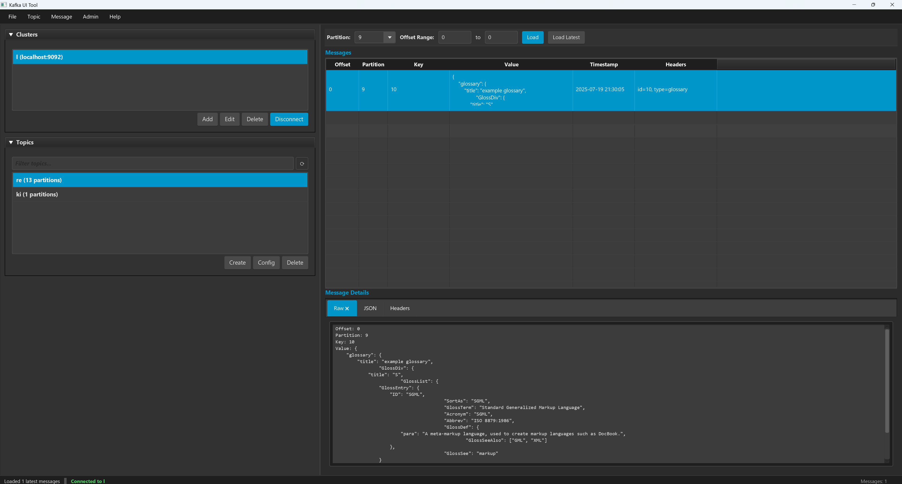

# Kafka UI Tool v2.0 - Cross-Platform Java/JavaFX Edition
## 🚀 New Java/JavaFX Implementation

The tool has been completely rewritten in Java using JavaFX for cross-platform compatibility and modern UI design.


### Key Features
- **Cross-Platform**: Runs on Windows, macOS, and Linux
- **Modern UI**: JavaFX with elegant dark theme and CSS styling
- **Robust Architecture**: MVC pattern with async operations and proper error handling
- **Apache Kafka Integration**: Uses official Apache Kafka Java client
- **Advanced Features**: Message search, filtering, export/import capabilities
- **Persistent Settings**: Automatic saving of cluster configurations

## Requirements
- **Java 17+**: OpenJDK or Oracle JDK 17 or higher
- **Maven 3.6+**: For building the project (or use included Maven Wrapper)
- **JavaFX 21**: Included as dependency
- **Cross-Platform**: Works on Windows, macOS, and Linux

## 🎯 Features & Implementation Status

### ✅ Completed Features
- **Project Architecture**: Maven-based Java project with MVC pattern
- **Modern UI**: JavaFX with FXML and elegant dark theme CSS
- **Cluster Management**: Add, edit, delete, and connect to Kafka clusters
- **Topic Management**: List, create, delete, and configure topics
- **Message Operations**: View messages, produce messages, search functionality
- **Partition Support**: View partition information and load messages by offset range
- **Settings Persistence**: Automatic saving of cluster configurations
- **Error Handling**: Comprehensive error handling with user-friendly dialogs
- **Logging**: Structured logging with file rotation
- **Cross-Platform**: Tested build system for Windows, macOS, and Linux

### 🚧 Advanced Features (Future Enhancements)

#### 🏢 Enterprise Administration
- **Consumer Group Management**: Monitor lag, reset offsets, view group details and member assignments
- **Security & Authentication**: SASL/SCRAM, SSL/TLS, LDAP integration, and ACL management
- **Multi-Cluster Management**: Manage multiple Kafka environments from a single interface
- **User Permissions**: Role-based access control and audit logging
- **Cluster Health Monitoring**: Real-time metrics, alerts, and performance dashboards

#### 🔄 Schema & Data Management
- **Schema Registry Integration**: Support for Avro, JSON Schema, and Protobuf with schema evolution
- **Message Serialization**: Advanced deserializers for various data formats (Avro, Protobuf, etc.)
- **Data Quality Checks**: Message validation and schema compatibility verification
- **Schema Versioning**: Browse schema history and manage schema evolution policies

#### 📊 Advanced Message Operations
- **Message Export/Import**: Bulk export to JSON/CSV/Avro and import from various formats
- **Message Replay**: Replay messages from specific offsets or time ranges
- **Bulk Message Operations**: Batch produce, delete, and modify operations
- **Message Transformation**: Built-in data transformation and filtering capabilities
- **Advanced Search**: Regex patterns, JQ queries, and full-text search across message content

#### 🔌 Kafka Ecosystem Integration
- **Kafka Connect Management**: Deploy, monitor, and manage connectors and tasks
- **Kafka Streams Visualization**: Topology diagrams and stream processing monitoring
- **KSQL/ksqlDB Integration**: Execute queries and manage streams/tables
- **Mirror Maker Management**: Configure and monitor cross-cluster replication

#### 📈 Monitoring & Analytics
- **Real-time Streaming Dashboard**: Live message flow visualization and topic activity
- **Performance Metrics**: Throughput, latency, and resource utilization monitoring
- **Custom Alerting**: Configurable alerts for lag, errors, and performance thresholds
- **Historical Analytics**: Long-term trend analysis and capacity planning tools
- **Interactive Charts**: Drill-down capabilities for detailed performance analysis

#### 🛠 Developer Experience
- **Plugin System**: Extensible architecture for custom features and integrations
- **REST API**: Programmatic access to tool functionality for automation
- **CLI Interface**: Command-line tools for scripting and CI/CD integration
- **Configuration Management**: Environment-specific configurations and deployment profiles
- **Workspace Management**: Save and restore tool layouts and connection profiles

#### 🎨 UI/UX Enhancements
- **Custom Themes**: Light theme and customizable color schemes
- **Advanced Layouts**: Tabbed interface, floating panels, and workspace customization
- **Keyboard Shortcuts**: Power-user keyboard navigation and shortcuts
- **Message Formatting**: Syntax highlighting for JSON, XML, and other formats
- **Responsive Design**: Optimized layouts for different screen sizes and resolutions

#### 🔒 Data Protection & Compliance
- **Data Masking**: Configurable field masking for sensitive data
- **Encryption Support**: End-to-end encryption for stored configurations and logs
- **Compliance Tools**: GDPR-compliant data handling and retention policies
- **Backup & Recovery**: Configuration backup and disaster recovery features

## 🛠 Build & Run

### Quick Start (Windows)
For Windows users, we provide automated build scripts:

```cmd
# Development build (compile + test + package)
build.bat

# Production release (creates Windows exe with embedded JRE)
release.bat
```

See [BUILD_SCRIPTS.md](BUILD_SCRIPTS.md) for detailed information about the automated build process.

### Manual Build Prerequisites
1. **Install Java 17+**:
   ```bash
   # Ubuntu/Debian
   sudo apt update && sudo apt install openjdk-17-jdk
   
   # macOS (using Homebrew)
   brew install openjdk@17
   
   # Windows (using Chocolatey)
   choco install openjdk17
   ```

2. **Maven**: Choose one option:
   - **Option A - Use Maven Wrapper (Recommended)**: No installation needed! The project includes Maven Wrapper
   - **Option B - Install Maven 3.6+**:
     ```bash
     # Ubuntu/Debian
     sudo apt install maven
     
     # macOS (using Homebrew) 
     brew install maven
     
     # Windows (using Chocolatey)
     choco install maven
     ```

### Build Instructions

#### Using Maven Wrapper (Recommended)
The project includes Maven Wrapper, so you don't need to install Maven separately:

```bash
# Clone the repository
git clone https://github.com/sriram980980/KafkaUITool.git
cd KafkaUITool/kafka-ui-java

# On Windows
.\mvnw.cmd clean compile
.\mvnw.cmd test
.\mvnw.cmd clean package
.\mvnw.cmd javafx:run

# On macOS/Linux
./mvnw clean compile
./mvnw test  
./mvnw clean package
./mvnw javafx:run
```

#### Using Installed Maven
If you have Maven installed:

```bash
# Clone the repository
git clone https://github.com/sriram980980/KafkaUITool.git
cd KafkaUITool/kafka-ui-java

# Compile the project
mvn clean compile

# Run tests (when available)
mvn test

# Package the application
mvn clean package

# Run the application
mvn javafx:run
```

### Running the JAR
```bash
# Build JAR with dependencies (using wrapper)
.\mvnw.cmd clean package    # Windows
./mvnw clean package       # macOS/Linux

# Or with installed Maven
mvn clean package

# Run the standalone JAR
java --module-path /path/to/javafx/lib --add-modules javafx.controls,javafx.fxml -jar target/kafka-ui-tool-2.0.0-jar-with-dependencies.jar
```

## 🎨 Architecture

### Project Structure
```
kafka-ui-java/
├── src/main/java/com/kafkatool/
│   ├── KafkaUIApplication.java          # Main application class
│   ├── controller/
│   │   └── MainController.java          # Main UI controller (MVC)
│   ├── model/
│   │   ├── ClusterInfo.java            # Cluster data model
│   │   ├── TopicInfo.java              # Topic data model
│   │   └── KafkaMessage.java           # Message data model
│   ├── service/
│   │   ├── KafkaService.java           # Service interface
│   │   └── KafkaServiceImpl.java       # Kafka operations implementation
│   └── util/
│       ├── DialogHelper.java           # UI dialog utilities
│       ├── JsonFormatter.java          # JSON formatting utilities
│       └── SettingsManager.java        # Settings persistence
├── src/main/resources/
│   ├── fxml/
│   │   └── main.fxml                   # Main UI layout
│   ├── css/
│   │   └── application.css             # Dark theme stylesheet
│   └── logback.xml                     # Logging configuration
└── pom.xml                             # Maven project configuration
```

### Key Technologies
- **JavaFX 21**: Modern UI framework with FXML and CSS
- **Apache Kafka Client 3.6.1**: Official Kafka Java client
- **Jackson 2.16.1**: JSON processing
- **Logback 1.4.14**: Structured logging
- **Maven**: Build system and dependency management

## 📖 User Guide

### Getting Started
1. **Launch the Application**: Run the application using Maven or the standalone JAR
2. **Add a Kafka Cluster**: Click "File" → "Add Cluster" or use the "Add" button in the clusters panel
3. **Connect to Cluster**: Select a cluster and click "Connect" or double-click the cluster name
4. **Explore Topics**: Once connected, topics will be automatically loaded in the left panel

### Managing Clusters
- **Add Cluster**: Provide cluster name and broker URLs (e.g., `localhost:9092`)
- **Edit Cluster**: Right-click cluster or use "Edit" button to modify settings
- **Connect/Disconnect**: Use "Connect" button or double-click cluster name
- **Delete Cluster**: Select cluster and click "Delete" button

### Topic Operations
- **Filter Topics**: Use the search field to filter topics by name
- **Create Topic**: Click "Create" button and specify partitions and replication factor
- **View Topic Config**: Select topic and click "Config" to view topic settings
- **Delete Topic**: Select topic and click "Delete" (use with caution!)

### Message Operations
- **Select Partition**: Choose partition from dropdown
- **Load Messages**: Specify offset range and click "Load" or use "Load Latest"
- **View Message Details**: Click on any message to see raw, JSON, and headers
- **Produce Message**: Use "Message" → "Produce Message" to send new messages
- **Search Messages**: Use "Message" → "Search Messages" for pattern-based search

### Settings & Configuration
- **Persistent Storage**: Cluster configurations are automatically saved
- **Logging**: Application logs are saved to `~/.kafka-ui-tool/kafka-ui-tool.log`
- **Theme**: Modern dark theme with elegant styling

## 🔧 Troubleshooting

### Common Issues
1. **Connection Failed**: Verify Kafka broker URLs and network connectivity
2. **Build Errors**: Ensure Java 17+ and Maven 3.6+ are installed
3. **UI Issues**: Make sure JavaFX is properly installed for your platform

### Platform-Specific Notes
- **Linux**: May require additional JavaFX installation: `sudo apt install openjfx`
- **macOS**: Works with both Intel and Apple Silicon Macs
- **Windows**: Requires Java 17+ with JavaFX support

## 🔄 Legacy C# Version

The previous C# Windows Forms implementation has been moved to the `legacy-csharp/` directory. The Java/JavaFX version is now the primary implementation offering:
- Cross-platform compatibility
- Modern, responsive UI
- Better architecture and maintainability
- Enhanced error handling and logging

---

## 🤝 Contributing

Contributions are welcome! Please feel free to submit pull requests or open issues for bugs and feature requests.

## 📄 License

This project is open source. See the repository for license details.

---

*Built with ❤️ using Java, JavaFX, and Apache Kafka*
