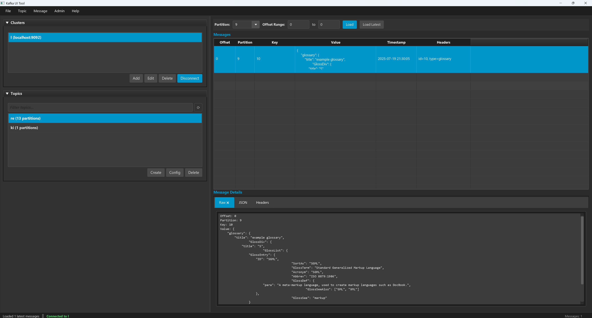
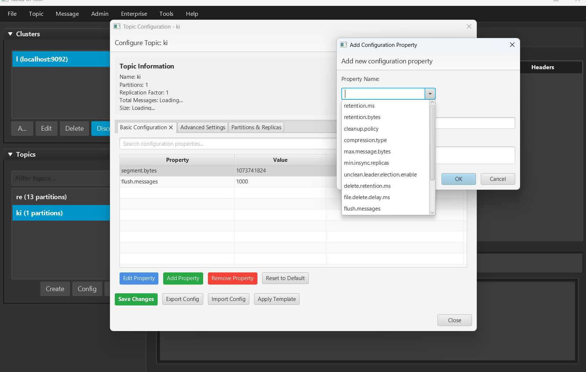
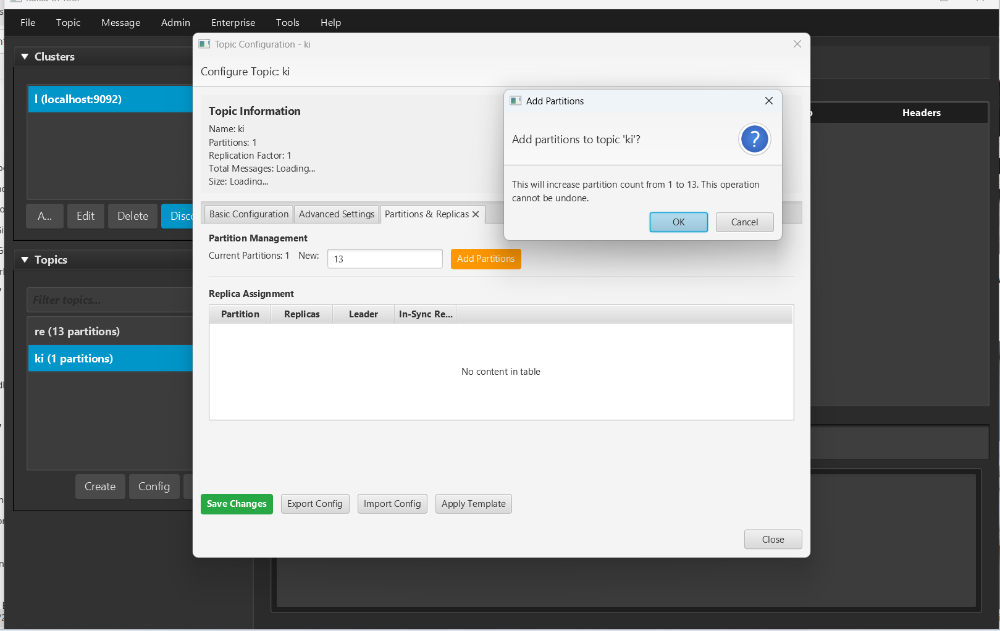
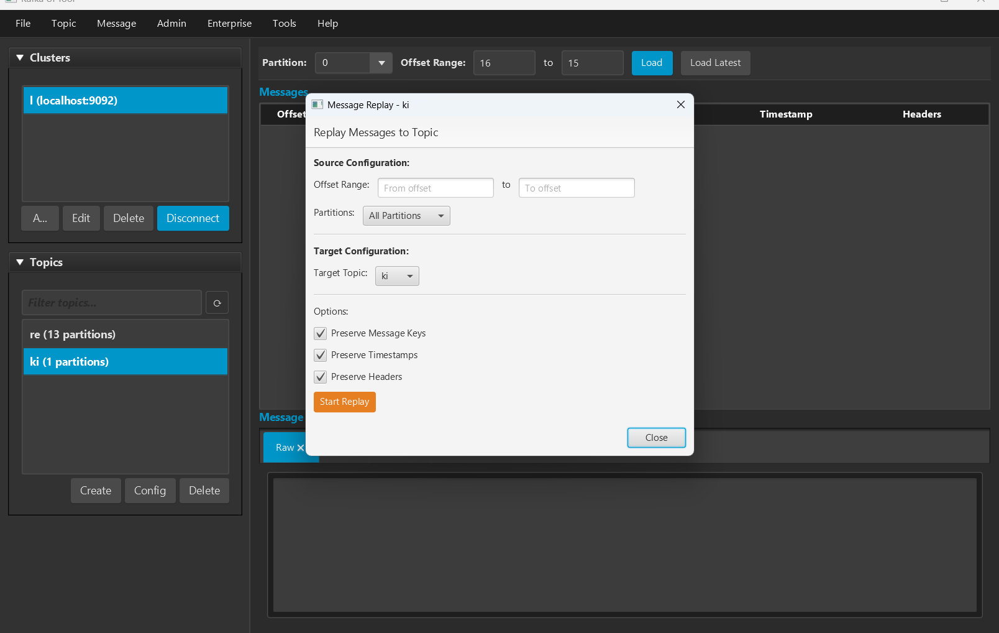

# Kafka UI Tool v2.0 - Cross-Platform Java/JavaFX Edition

## ⚠️ **EXPERIMENTAL SOFTWARE DISCLAIMER**
**This software is experimental and provided "AS IS" without any warranties or guarantees. Use at your own risk. The authors and contributors are not responsible for any data loss, system failures, or other damages that may occur from using this software. This tool is intended for development and testing purposes.**

## 🚀 New Java/JavaFX Implementation

The tool has been completely rewritten in Java using JavaFX for cross-platform compatibility and modern UI design.





### Key Features
- **Cross-Platform**: Runs on Windows, macOS, and Linux
- **Modern UI**: JavaFX with elegant dark theme and CSS styling
- **Robust Architecture**: MVC pattern with async operations and proper error handling
- **Apache Kafka Integration**: Uses official Apache Kafka Java client
- **Advanced Features**: Message search, filtering, export/import capabilities
- **Persistent Settings**: Automatic saving of cluster configurations

## Requirements
- **Java 17+**: OpenJDK or Oracle JDK 17 or higher
- **Maven 3.6+**: For building the project (or use included Maven Wrapper)
- **JavaFX 21**: Included as dependency
- **Cross-Platform**: Works on Windows, macOS, and Linux

## 🎯 Features & Implementation Status

### ✅ Core Features (Completed)
- **Project Architecture**: Maven-based Java project with MVC pattern
- **Modern UI**: JavaFX with FXML and elegant dark theme CSS
- **Unified Entry Point**: Smart main class that automatically detects GUI vs API server mode
- **Headless API Server**: REST API server that runs independently of JavaFX for containerized/server deployments
- **Cluster Management**: Add, edit, delete, and connect to Kafka clusters
- **Topic Management**: List, create, delete, and configure topics
- **Message Operations**: View messages, produce messages, search functionality
- **Partition Support**: View partition information and load messages by offset range
- **Settings Persistence**: Automatic saving of cluster configurations
- **Error Handling**: Comprehensive error handling with user-friendly dialogs
- **Logging**: Structured logging with file rotation
- **Cross-Platform**: Tested build system for Windows, macOS, and Linux

### ✅ Advanced Enterprise Features (Completed)

#### 🏢 Enterprise Administration
- **Consumer Group Management**: Complete lifecycle management, lag monitoring, offset reset operations
- **Security & Authentication**: ACL management, data masking, encryption, GDPR compliance tools
- **Multi-Cluster Management**: Unified interface for multiple Kafka environments
- **User Permissions**: Role-based access control with comprehensive audit logging
- **Cluster Health Monitoring**: Real-time metrics, custom alerting, and performance dashboards

#### 🔄 Schema & Data Management
- **Schema Registry Integration**: Full support for Avro, JSON Schema, and Protobuf with schema evolution
- **Message Serialization**: Advanced deserializers for various data formats
- **Data Quality Checks**: Message validation and schema compatibility verification
- **Schema Versioning**: Complete schema history management and evolution policies

#### 📊 Advanced Message Operations
- **Message Export/Import**: Bulk operations supporting JSON, CSV, and Avro formats
- **Message Replay**: Advanced replay capabilities with transformation support
- **Bulk Message Operations**: Batch produce, delete, and modify operations
- **Message Transformation**: Built-in data transformation and filtering capabilities
- **Advanced Search**: Regex patterns, JQ queries, and full-text search across message content

#### 🔌 Kafka Ecosystem Integration
- **Kafka Connect Management**: Complete connector lifecycle management and monitoring
- **Kafka Streams Visualization**: Topology diagrams and stream processing monitoring
- **KSQL/ksqlDB Integration**: Query execution and stream/table management
- **Mirror Maker Management**: Cross-cluster replication configuration and monitoring

#### 📈 Monitoring & Analytics
- **Real-time Streaming Dashboard**: Live message flow visualization and topic activity
- **Performance Metrics**: Comprehensive throughput, latency, and resource utilization monitoring
- **Custom Alerting**: Configurable alerts for lag, errors, and performance thresholds
- **Historical Analytics**: Long-term trend analysis and capacity planning tools
- **Interactive Charts**: Advanced drill-down capabilities for detailed performance analysis

#### 🛠 Developer Experience
- **Plugin System**: Extensible architecture for custom features and integrations
- **REST API**: Complete programmatic access to all tool functionality for automation
- **CLI Interface**: Comprehensive command-line tools for scripting and CI/CD integration
- **Configuration Management**: Environment-specific configurations and deployment profiles
- **Workspace Management**: Save and restore tool layouts and connection profiles

#### 🎨 UI/UX Enhancements
- **Custom Themes**: Light and dark themes with customizable color schemes
- **Advanced Layouts**: Tabbed interface, floating panels, and workspace customization
- **Keyboard Shortcuts**: Power-user keyboard navigation and shortcuts
- **Message Formatting**: Syntax highlighting for JSON, XML, and other formats
- **Responsive Design**: Optimized layouts for different screen sizes and resolutions

#### 🔒 Data Protection & Compliance
- **Data Masking**: Configurable field masking for sensitive data protection
- **Encryption Support**: End-to-end encryption for stored configurations and logs
- **Compliance Tools**: GDPR-compliant data handling and retention policies
- **Backup & Recovery**: Configuration backup and disaster recovery features

## 🛠 Build & Run

### 🚀 Quick Start Guide

#### Option 1: Launch GUI Application (Recommended for Desktop Users)
```bash
# Clone the repository
git clone https://github.com/sriram980980/KafkaUITool.git
cd KafkaUITool

# Launch the GUI application directly
./mvnw javafx:run -pl ui

# Alternative: Build and run JAR
./mvnw clean package
java -jar ui/target/kafka-ui-application-2.0.0-jar-with-dependencies.jar
```

#### Option 2: Launch REST API Server (For Remote Access)
```bash
# Build and run with REST API server
./mvnw clean package
java -jar service/target/kafka-ui-service-2.0.0-jar-with-dependencies.jar --api-server --port=8080

# Server will be available at: http://localhost:8080
# The API server runs independently of JavaFX and can be used in headless environments
```

#### Option 3: Use Release Script (Recommended for Production)
```bash
# Build everything and create release artifacts
./release.sh

# Run UI from release directory
java -jar release/kafka-ui-application-2.0.0-jar-with-dependencies.jar

# Run service from release directory
java -jar release/kafka-ui-service-2.0.0-jar-with-dependencies.jar --api-server
```

### 🎯 Platform-Specific Quick Start

#### Windows Users
```cmd
# Development build (compile + test + package)
.\mvnw.cmd clean package

# Production release (creates release artifacts)
.\release.bat

# Run the GUI
.\mvnw.cmd javafx:run -pl ui
```

#### macOS/Linux Users
```bash
# Make scripts executable
chmod +x release.sh

# Quick development run
./mvnw javafx:run -pl ui

# Production release
./release.sh

# Manual build and run
./mvnw clean package
```

### 📦 Packaging and Distribution

#### Create Standalone JARs
```bash
# Build all modules
./mvnw clean package

# Creates:
# - ui/target/kafka-ui-application-2.0.0-jar-with-dependencies.jar
# - service/target/kafka-ui-service-2.0.0-jar-with-dependencies.jar
# Both JARs include all dependencies and can be distributed
```

#### Create Native Installers (Advanced)
```bash
# Requires JDK 17+ with jpackage tool
./mvnw clean package
jpackage --input ui/target --main-jar kafka-ui-application-2.0.0-jar-with-dependencies.jar --main-class com.kafkatool.ui.Main --name "Kafka UI Tool" --type msi  # Windows
jpackage --input ui/target --main-jar kafka-ui-application-2.0.0-jar-with-dependencies.jar --main-class com.kafkatool.ui.Main --name "Kafka UI Tool" --type dmg  # macOS
jpackage --input ui/target --main-jar kafka-ui-application-2.0.0-jar-with-dependencies.jar --main-class com.kafkatool.ui.Main --name "Kafka UI Tool" --type deb  # Linux
```

### 🔧 Development Setup

### Manual Build Prerequisites
1. **Install Java 17+**:
   ```bash
   # Ubuntu/Debian
   sudo apt update && sudo apt install openjdk-17-jdk
   
   # macOS (using Homebrew)
   brew install openjdk@17
   
   # Windows (using Chocolatey)
   choco install openjdk17
   ```

2. **Maven**: Choose one option:
   - **Option A - Use Maven Wrapper (Recommended)**: No installation needed! The project includes Maven Wrapper
   - **Option B - Install Maven 3.6+**:
     ```bash
     # Ubuntu/Debian
     sudo apt install maven
     
     # macOS (using Homebrew) 
     brew install maven
     
     # Windows (using Chocolatey)
     choco install maven
     ```

### Enterprise Features
For comprehensive documentation on all advanced features, see [docs/COMPREHENSIVE_FEATURES.md](docs/COMPREHENSIVE_FEATURES.md).

#### Key Enterprise Capabilities
- **REST API**: Full programmatic access on port 8080
- **CLI Tools**: Command-line interface for automation
- **Plugin System**: Extensible architecture
- **Monitoring Dashboard**: Real-time metrics and alerts
- **Schema Registry**: Complete schema management
- **Kafka Connect**: Connector lifecycle management
- **Security**: Data masking, encryption, ACL management
- **Multi-cluster**: Unified management interface

### Build Instructions

#### Using Maven Wrapper (Recommended)
The project includes Maven Wrapper, so you don't need to install Maven separately:

```bash
# Clone the repository
git clone https://github.com/sriram980980/KafkaUITool.git
cd KafkaUITool

# On Windows
.\mvnw.cmd clean compile
.\mvnw.cmd test
.\mvnw.cmd clean package
.\mvnw.cmd javafx:run -pl ui

# On macOS/Linux
./mvnw clean compile
./mvnw test  
./mvnw clean package
./mvnw javafx:run -pl ui
```

#### Using Installed Maven
If you have Maven installed:

```bash
# Clone the repository
git clone https://github.com/sriram980980/KafkaUITool.git
cd KafkaUITool

# Compile the project
mvn clean compile

# Run tests (when available)
mvn test

# Package the application
mvn clean package

# Run the UI application
mvn javafx:run -pl ui
```

### Running the JAR
```bash
# Build JARs with dependencies (using wrapper)
.\mvnw.cmd clean package    # Windows
./mvnw clean package       # macOS/Linux

# Or with installed Maven
mvn clean package

# Run the GUI application (default)
java -jar ui/target/kafka-ui-application-2.0.0-jar-with-dependencies.jar

# Show help
java -jar ui/target/kafka-ui-application-2.0.0-jar-with-dependencies.jar --help

# Run with REST API server
java -jar service/target/kafka-ui-service-2.0.0-jar-with-dependencies.jar --api-server --port=8080

# Service help
java -jar service/target/kafka-ui-service-2.0.0-jar-with-dependencies.jar --help
```

## 📚 Documentation

### Additional Documentation
- [Build Scripts Documentation](docs/BUILD_SCRIPTS.md) - Detailed build information and automated scripts
- [Comprehensive Features](docs/COMPREHENSIVE_FEATURES.md) - Complete feature documentation  
- [Implementation Summary](docs/IMPLEMENTATION_SUMMARY.md) - Technical implementation details
- [UI Layout Diagram](docs/UI_LAYOUT_DIAGRAM.md) - User interface design documentation
- [Testing Report](docs/FINAL_TESTING_REPORT.md) - Test results and regression information
- [Screenshots](docs/screenshots-documentation.md) - Visual documentation

## 🎨 Architecture

### Project Structure
```
KafkaUITool/
├── pom.xml                              # Parent POM
├── commons/                             # Shared models and services
│   ├── src/main/java/com/kafkatool/
│   │   ├── model/                       # Data models
│   │   ├── service/                     # Kafka services
│   │   └── util/                        # Utilities
│   └── pom.xml
├── ui/                                  # JavaFX GUI application
│   ├── src/main/java/com/kafkatool/ui/
│   │   ├── Main.java                    # UI main class
│   │   ├── KafkaUIApplication.java      # JavaFX application
│   │   ├── controller/                  # UI controllers
│   │   └── DialogHelper.java            # UI utilities
│   ├── src/main/resources/
│   │   ├── fxml/                        # FXML layouts
│   │   ├── css/                         # Stylesheets
│   │   ├── images/                      # Images
│   │   └── logback.xml                  # UI logging config
│   └── pom.xml
├── service/                             # Headless REST API service
│   ├── src/main/java/com/kafkatool/service/
│   │   ├── KafkaServiceMain.java        # Service main class
│   │   └── api/                         # REST API
│   └── pom.xml
├── release.sh                           # Release build script
└── README.md                            # This file
```

### Key Technologies
- **JavaFX 21**: Modern UI framework with FXML and CSS
- **Apache Kafka Client 3.6.1**: Official Kafka Java client
- **Jackson 2.16.1**: JSON processing
- **Logback 1.4.14**: Structured logging
- **Maven**: Build system and dependency management
- **Javalin**: REST API server (service module)

## 📖 User Guide

### Getting Started
1. **Launch the Application**: Run the application using Maven or the standalone JAR
2. **Add a Kafka Cluster**: Click "File" → "Add Cluster" or use the "Add" button in the clusters panel
3. **Connect to Cluster**: Select a cluster and click "Connect" or double-click the cluster name
4. **Explore Topics**: Once connected, topics will be automatically loaded in the left panel

### Managing Clusters
- **Add Cluster**: Provide cluster name and broker URLs (e.g., `localhost:9092`)
- **Edit Cluster**: Right-click cluster or use "Edit" button to modify settings
- **Connect/Disconnect**: Use "Connect" button or double-click cluster name
- **Delete Cluster**: Select cluster and click "Delete" button

### Topic Operations
- **Filter Topics**: Use the search field to filter topics by name
- **Create Topic**: Click "Create" button and specify partitions and replication factor
- **View Topic Config**: Select topic and click "Config" to view topic settings
- **Delete Topic**: Select topic and click "Delete" (use with caution!)

### Message Operations
- **Select Partition**: Choose partition from dropdown
- **Load Messages**: Specify offset range and click "Load" or use "Load Latest"
- **View Message Details**: Click on any message to see raw, JSON, and headers
- **Produce Message**: Use "Message" → "Produce Message" to send new messages
- **Search Messages**: Use "Message" → "Search Messages" for pattern-based search

### Settings & Configuration
- **Persistent Storage**: Cluster configurations are automatically saved
- **Logging**: Application logs are saved to `~/.kafka-ui-tool/kafka-ui-application.log` (UI) and service logs to appropriate locations
- **Theme**: Modern dark theme with elegant styling

## 🔧 Troubleshooting

### Common Issues
1. **Connection Failed**: Verify Kafka broker URLs and network connectivity
2. **Build Errors**: Ensure Java 17+ and Maven 3.6+ are installed
3. **UI Issues**: Make sure JavaFX is properly installed for your platform
4. **API Server Launch Issues**: 
   - Use `--api-server` flag to run in headless mode without JavaFX
   - The API server is now decoupled from JavaFX and can run in containerized environments
   - Check that the port is not already in use

### Usage Modes
The application now supports multiple launch modes:

**GUI Mode (Default)**: 
```bash
java -jar ui/target/kafka-ui-application-2.0.0-jar-with-dependencies.jar
# Requires JavaFX for desktop interface
```

**API Server Mode**:
```bash
java -jar service/target/kafka-ui-service-2.0.0-jar-with-dependencies.jar --api-server --port=8080
# Runs headless REST API server, no JavaFX required
```

**Help/CLI Mode**:
```bash
java -jar ui/target/kafka-ui-application-2.0.0-jar-with-dependencies.jar --help
java -jar service/target/kafka-ui-service-2.0.0-jar-with-dependencies.jar --help
# Shows usage information
```

### Platform-Specific Notes
- **Linux**: May require additional JavaFX installation: `sudo apt install openjfx`
- **macOS**: Works with both Intel and Apple Silicon Macs
- **Windows**: Requires Java 17+ with JavaFX support
- **Docker/Containers**: Use `--api-server` mode for containerized deployments

## 🔄 Legacy C# Version

The previous C# Windows Forms implementation has been moved to the `legacy-csharp/` directory. The Java/JavaFX version is now the primary implementation offering:
- Cross-platform compatibility
- Modern, responsive UI
- Better architecture and maintainability
- Enhanced error handling and logging

---

## 🤝 Contributing

Contributions are welcome! Please feel free to submit pull requests or open issues for bugs and feature requests.

## 📄 License

This project is licensed under the **Mozilla Public License 2.0 (MPL-2.0)**.

### License Summary
- ✅ **Free to use** for personal, educational, and commercial purposes
- ✅ **Commercial use allowed** without restrictions
- ✅ **Modification and distribution** permitted
- ⚠️ **Copyleft requirement**: If you modify and distribute this software, you must make your source code available under the same license
- ⚠️ **Enterprise users**: Any modifications or derivative works must be published as open source

This license ensures the software remains free and open while requiring enterprise users who modify the code to contribute back to the community.

For the complete license text, see the [LICENSE](LICENSE) file.

### Quick License Guide
| Use Case | Allowed | Requirements |
|----------|---------|--------------|
| Personal use | ✅ Yes | None |
| Commercial use | ✅ Yes | None |
| Modify for internal use | ✅ Yes | Source code must be available if distributed |
| Distribute modifications | ✅ Yes | Must publish source code under MPL-2.0 |
| Create proprietary derivative | ❌ No | Must remain open source |

---

*Built with ❤️ using Java, JavaFX, and Apache Kafka*